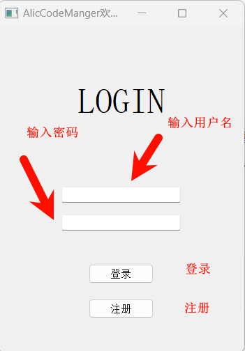
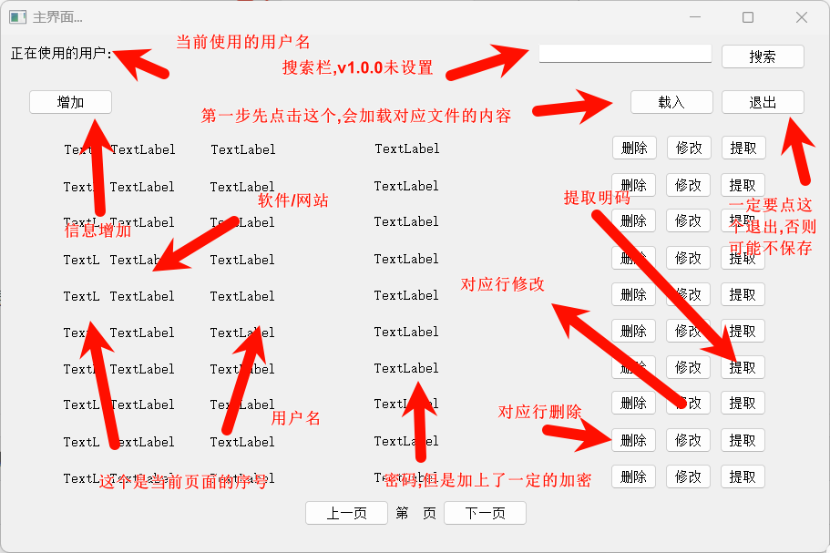

# Readme

[TOC]

## 介绍

本项目基于Qt5.12.2编写的一个密码管理器(AlicCodeManager),为鄙人的一个平常使用的一个密码管理器.本项目由于是本人一人完成,更新、优化和界面等相较于其他的开源软件可能会差很多.

本项目为免费开源,如有需用,请注明来源.

## 使用说明

目前还没有导出exe,还只供用Qt的人员使用.

config文件里面是记录登录信息的,这里的文件请保持不动.

userinf文件夹里的文件是生成的密码存储文件,后缀为psw

resource是相应的资源文件,但由于之前存在一定的bug,这里的资源文件并没有进行配置.

在一开始是一个登陆界面,第一行为账户,第二行为密码,请保证你记得你的密码.目前不支持忘记密码的操作.

然后一个这样的界面,在v1.0.0版本为了更快的开机速度,并不会对基本见面进行加载,需要手动更新.

## 更新介绍

|  版本  |               更新内容                |   时间    |
| :----: | :-----------------------------------: | :-------: |
| v1.0.0 | 完成对密码管理器的基本配置.未进行优化 | 2024/5/25 |

如果感觉有用还请点个星.
